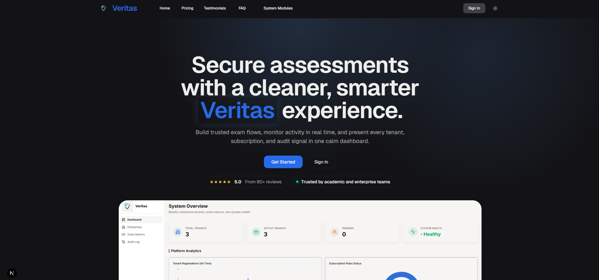

# Veritas Front Page

Landing page for Veritas, an AI-enhanced online assessment and monitoring platform focused on secure exam delivery, real-time proctoring intelligence, and multi-tenant institutional workflows.



## Overview

The site presents Veritas product capabilities through a modern, animated, responsive marketing experience built with the Next.js App Router.

Main homepage flow:

- Hero and product positioning
- System modules section
- Platform comparison (Traditional vs Veritas)
- Performance and compliance stats
- Testimonials
- Pricing (ETB monthly/yearly)
- FAQ and final CTA

## Tech Stack

- Next.js 16 (App Router)
- React 18 + TypeScript
- Tailwind CSS
- HeroUI
- Framer Motion
- Radix Icons
- next-themes

## Product Highlights

- Smart gaze and proctoring signals
- Continuous biometric face verification
- Multi-tenant architecture for institutions/departments
- Cheating anomaly index and timestamped activity review
- EPDPP-aligned data protection messaging
- AI-enhanced analysis support for essay-style responses
- Pricing tiers in ETB with monthly/yearly billing view

## Project Structure

- `app/`
  - `layout.tsx`: global fonts, metadata, providers wrapper
  - `page.tsx`: homepage composition
  - `providers.tsx`: HeroUI + theme provider setup
  - `Veritas-opengraph.png`: README/social preview asset
- `components/`
  - `navbar.tsx`, `hero.tsx`, `features.tsx`, `how-it-works.tsx`
  - `stats.tsx`, `testimonials.tsx`, `pricing.tsx`, `faq.tsx`, `cta.tsx`, `footer.tsx`
  - `theme-switcher.tsx`, `AnimatedTextHalf.tsx`
- `components/ui/`
  - reusable UI primitives and effects
- `public/Images/`
  - product and brand assets used across the page

## Getting Started

1. Clone the repository:

   ```bash
   git clone https://github.com/tadid418-s/Inventory-Management-system.git
   ```

2. Install dependencies:

   ```bash
   npm install
   ```

3. Start development server:

   ```bash
   npm run dev
   ```

4. Open:

   ```text
   http://localhost:3000
   ```

## Scripts

- `npm run dev` starts Next.js in webpack mode (`next dev --webpack`) for stable local development
- `npm run build` creates a production build
- `npm run start` starts the production server
- `npm run lint` runs lint checks

## Content and Pricing Updates

- Homepage section order is controlled in `app/page.tsx`
- Pricing data is managed in `components/pricing.tsx`
  - Plan metadata is in the `plans` array
  - Yearly mode applies a 15% discount to the monthly base
- Hero and module messaging is in `components/hero.tsx` and `components/features.tsx`

## Theming and Styling

- Global styles: `app/globals.css`
- Tailwind config: `tailwind.config.ts`
- Theme provider: `app/providers.tsx`
- Theme toggle: `components/theme-switcher.tsx`

